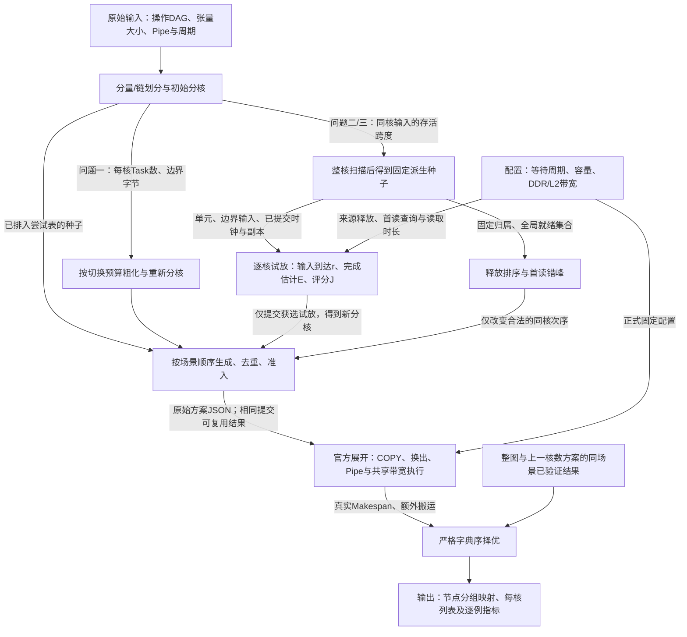

# FINAL IDEA：面向同步开销、张量复用与首读时序的多核调度

题目：2026 年华为杯 A 题《通用神经网络处理器下的多核调度问题》

日期：2026-09-24

阶段：Idea 定稿与求解验证。本文给出模型、算法和实施接口；实验状态与结果按实际记录列明。

## 1. 核心问题与方案

本题决定计算图怎样分块、各块放在哪个核心，以及同核先执行哪个块。多切几块能释放并行机会，也会增加同步和重复搬运；几个小分量放到同一核心后，共同输入可能长期驻留；同一张量被多个核心读取时，首读完成与后读发射的先后又决定能否命中L2。

**核心思路是先分核，再用同步开销、整核驻留和输入到达时序修正粒度、核心归属与同核次序，最后按官方实际时间选解。** 三问共用“构造候选—检查合法性—真实择优”的流程，场景差异进入构造规则：

| 问题 | 主要矛盾 | 直接改变的决策 |
|---|---|---|
| 一 | 小Task增加切换和跨核等待 | 用每核任务数预算控制粗化，合法合并后按规则重新分核 |
| 二 | 同核存活压力与不同目标核的重复COPY | 整核扫描触发新粒度；把精确新增搬运及输入就绪时间用于选核 |
| 三 | FIFO容量、首读完成和带宽共同改变后读代价 | 在预计发射时查询首读索引，按DDR/L2路径重新定价；用合法调序错开首读 |

每个多核配置最多准入4、4、7个不同搜索候选。问题二的搬运定价、问题三的缓存定价放在第二个尝试位置；整图与较少核心的已验证方案另外保留。最后先比较Makespan，时间相同再比较额外搬运。




本轮全量核验：100例、三场景、1—5核共1500个配置均完成搜索。五核下，问题一平均单核基准加速比为3.555914，问题二经共同池补评后为4.166085；同一候选池两侧分别择优的平均L2加速比为1.029959。均值均按100个逐例比值计算，机制入选、资源影响和计算成本见 §7.5、§8.5。

图中预计时钟和副本只用于构造。交给官方程序的是分组与核心列表；真实换出、缓存事件和时间由评估器重新计算。模型与算法见第2—6节，机制证据见第7节，接口和计算安排见第8节。

## 2. 提交决策与显式执行模型

### 2.1 输入和符号

原图是操作—张量二部 DAG。去掉输入中的 COPY_IN、COPY_OUT 后，计算操作集合为 $U$，张量集合为 $\mathcal T$；沿生产—消费关系得到计算 DAG $D=(U,A)$。共享输入通过张量消费者集合表示，不给互相独立的消费者添加先后关系。

| 符号 | 含义与单位 |
|---|---|
| $n,e,h$ | 计算操作数、计算依赖边数、操作—张量关联数 |
| $k,m$ | 可用核心数、非空子图数 |
| $c_u,p_u$ | 操作周期、操作使用的计算管道 |
| $s_t,r_t$ | 张量大小，bytes；存储位置 L1、UB 或 DDR |
| $z(u),a(g),\pi_c$ | 操作所属子图、子图所属核心、核心的子图列表 |
| $S_g,F_g$ | 问题一中 Task 激活和结束时刻，周期 |
| $s_i,f_i$ | 展开后操作的实际开始和完成时刻，周期 |
| $B^{\mathrm{orig}},B^{\mathrm{sched}},B^{\mathrm{hit}}$ | 原图 COPY、展开后全部 COPY、L2 命中字节 |
| $T_q(x)$ | 场景 $q$ 中提交 $x$ 的官方 Makespan |

题目的计算操作使用 M、V 两条管道；另有 MTE2、MTE3 两条搬运管道。官方实际持续时间包含最小一周期规则，统一记计算工作为 $\bar c_u=\max\{1,c_u\}$。100 个正式输入的计算周期均为正。

### 2.2 真正可控的变量和结构约束

提交变量为 $x=(z,a,\pi)$。为把覆盖和分配写清，引入二元表示 $y_{ug}=\mathbf 1\{z(u)=g\}$、$a_{gc}=\mathbf 1\{a(g)=c\}$，以及子图启用指示 $v_g$。候选子图编号最多取 $1,\ldots,n$：

$$
\sum_{g=1}^{n}y_{ug}=1,\qquad u\in U.
$$

$$
v_g\le\sum_{u\in U}y_{ug}\le n v_g,\qquad \sum_{c=1}^{k}a_{gc}=v_g.
$$

每个启用子图在其所属核心列表中恰好出现一次。数学式中的子图编号从1起算，JSON中的实现编号从0起算，两者只是标签差异。以整数 $r_g$ 表示商图拓扑位次；原图计算边跨越两个子图时，要求：

$$
(u,v)\in A,\ z(u)\ne z(v)\quad\Longrightarrow\quad r_{z(v)}\ge r_{z(u)}+1.
$$

同核存在直接子图依赖时，源子图在 $\pi_c$ 中排在目标之前。问题一还要求“子图依赖边与同核相邻顺序边的并图”无环，避免互相等待的 Task。问题二、三最终在展开后的操作依赖、Pipe 顺序和内存复用依赖上检查可执行性；它们没有逐子图完成屏障。算法在全局拓扑构造中采用以下充分条件：

$$
g\text{ 在 }\pi_c\text{ 中先于 }h\quad\Longrightarrow\quad r_g<r_h.
$$

同一组位次同时符合商图依赖和各核列表，因而构造中的顺序约束闭合。它定义本算法搜索的候选子集，不缩小题目原始可行域。

输出 JSON 只有两个字段：`node_to_subgraph` 把每个非 COPY 操作 ID 映射到子图 ID；`core_schedules` 给出每核子图列表。计算时刻、Cache 状态和换出选择均不进入提交文件。

### 2.3 官方展开怎样确定可执行操作

固定 $x$ 后，官方过程先补边界 COPY，确定核内拓扑顺序，再插入必要换入换出，并生成地址复用依赖及 Pipe 内执行顺序。问题二、三会依据 `core_schedules` 调整核内子图排序。因此，改变列表确实可以改变核内操作顺序，而不会凭空增加一个可提交的操作时间变量。

记展开后的操作集合为 $\mathcal O_q(x)$，数据、内存复用和 Pipe 相邻边集合为 $\mathcal P_q(x)$。对每条这样的边：

$$
s_j\ge f_i,\qquad (i,j)\in\mathcal P_q(x).
$$

每核每条 Pipe 同时最多执行一个操作；计算操作满足：

$$
f_i=s_i+\bar c_i.
$$

各操作遵循官方队列，在数据就绪、对应 Pipe 空闲、所属 Task 激活且内存复用依赖完成后的最早事件时刻发射。同一时刻的完成、Cache 插入、就绪更新和发射次序沿用官方实现。因而 $s_i,f_i$ 是 $x$ 及执行状态的派生量，不能在上述不等式之外任意选择一个更有利的时间表。

### 2.4 三问的同步和带宽差异

| 项目 | 问题一 | 问题二 | 问题三 |
|---|---|---|---|
| Task | 每子图一个 | 每核一个 | 每核一个 |
| 同核子图边界 | 插入边界搬运 | 核内容量允许时直接复用 | 同问题二 |
| 同核固定等待 | 前一 Task 完成后 100 周期 | 无子图完成屏障 | 同问题二 |
| 跨核同步 | 前驱 Task 完成后 1000 周期 | 源 COPY_OUT 完成后 500 周期，目标 COPY_IN 才可发射 | 同问题二 |
| 搬运资源 | 全核共享 DDR 60 bytes/cycle | 同左 | DDR 60，加独立共享 L2 250 |
| 容量 | 每核 L1 524288、UB 131072 bytes | 同左 | 另有全核共享只读 FIFO L2 1048576 bytes |

问题一中，$\operatorname{prev}(g)$ 表示同核前一个 Task，$\operatorname{pred}_{\ne}(g)$ 表示跨核前驱 Task。忽略不存在的前驱项，其激活为：

$$
S_g=\max\left\{0,\ F_{\operatorname{prev}(g)}+100,\ \max_{h\in\operatorname{pred}_{\ne}(g)}(F_h+1000)\right\},\qquad F_g=\max_{i\in\mathcal O(g)}f_i.
$$

Task 激活后仍受四 Pipe 和共享 DDR 约束。完成时间由四Pipe与共享DDR的并行执行产生。

问题二、三删除上述子图 Task 激活式，跨核生产—消费关系转为：

$$
s_{\mathrm{COPY\_IN}(t,c)}\ge f_{\mathrm{COPY\_OUT}(t,c)}+500.
$$

共享带宽不预先按核数平分。对搬运操作 $i$，所属资源池 $p$ 的额定带宽为 $b_p$，官方先计算参考工作：

$$
w_i=\max\left\{1,\left\lceil\frac{s_{t(i)}}{b_p}\right\rceil\right\}.
$$

设资源池当前未完成操作数为 $N_p(\tau)$。各在途搬运按同等份额消耗参考工作，连续部分的状态更新为：

$$
\frac{\mathrm d w_i^{\mathrm{rem}}(\tau)}{\mathrm d\tau}=-\frac{1}{N_p(\tau)}.
$$

池内成员变化时重新计算事件，完成时刻按官方整数周期规则向上取整。DDR 和 L2 两个池分别共享，命中的 COPY_IN 使用 L2 池，未命中 COPY_IN 与 COPY_OUT 使用 DDR 池。这解释了为什么“每条边的字节数除以 60 后相加”只能作为估计，不能决定最终时间。

### 2.5 存储约束中的真实驻留与代理扫描

对展开后的实际张量副本 $\xi$，在生产操作开始时分配输出空间，在最后一次实际使用完成后释放；无消费者输出在生产结束后释放，初始驻留张量从时刻 0 计。换出和重读将生命周期分成多个副本区间。记这些区间为 $[b_\xi,d_\xi)$。每核每种片上存储满足：

$$
M_{cr}(\tau)=\sum_{\xi:\operatorname{core}(\xi)=c,\operatorname{space}(\xi)=r}s_\xi\mathbf 1\{b_\xi\le\tau<d_\xi\}\le C_r.
$$

官方地址复用依赖与换入换出共同实现这个条件。求解器的“按拓扑序逐个访问操作并释放最后使用张量”得到的峰值 $\widehat M_{cr}$，只用来触发另一种划分。它既不是上述真实峰值的普遍上界，也不是可行性的硬约束。

极小反例已经执行：同核两个独立操作分别使用 M、V，各产生 60000 bytes 的 UB 输出。串行扫描峰值为 60000，而官方分配结果峰值为 120000。两条计算 Pipe 可以同时产生输出，串行扫描会漏掉这种重叠。原方案保留、修正方案比较的设计因此继续采用。

### 2.6 目标与精确搬运账目

主目标优先完成时间，时间相同时比较额外搬运：

$$
\min_{x\in\mathcal F_{q,k}}\left(T_q(x),B_q^{\mathrm{extra}}(x)\right)_{\mathrm{lex}},\qquad T_q(x)=\max_{i\in\mathcal O_q(x)}f_i.
$$

这里的可行集合包含上述覆盖、无环、顺序、资源及派生执行规则。执行器是该模型的确定性求值实现。候选排序采用严格字典序，不放宽 Makespan 来换取搬运下降，因而能与跨核继承的时间单调性同时成立。

正式输入中每个张量至多有一个计算生产者。$\mathcal T_{\mathrm{in}}$ 为外部计算输入，$\mathcal T_{\mathrm{out}}$ 为最终写回张量，$\mathcal T_{\mathrm p}$ 为有计算生产者的张量；$S_t,K_t$ 分别表示不同消费子图、不同消费核心集合，$g_t,c_t$ 是生产子图及核心。

问题一插入换出前的 COPY 字节为：

$$
B_1^{(0)}=\sum_{t\in\mathcal T_{\mathrm{in}}}s_t|S_t|+\sum_{t\in\mathcal T_{\mathrm p}}s_t\left(|S_t\setminus\{g_t\}|+\mathbf 1\{S_t\setminus\{g_t\}\ne\varnothing\ \mathrm{or}\ t\in\mathcal T_{\mathrm{out}}\}\right).
$$

问题二、三按不同核心计一次边界读入：

$$
B_{2,3}^{(0)}=\sum_{t\in\mathcal T_{\mathrm{in}}}s_t|K_t|+\sum_{t\in\mathcal T_{\mathrm{out}}}s_t+2\sum_{t\in\mathcal T_{\mathrm p}}s_t|K_t\setminus\{c_t\}|.
$$

问题一生产端对同一个需要送出的张量写一次；问题二、三对每个不同目标核各建一对 COPY_OUT/COPY_IN，最终写回另计。同一目标核上的多个消费者共享边界副本，不按消费者操作数重复计费。加入官方实际换入换出字节 $B_q^{\mathrm{spill}}$ 后：

$$
B_q^{\mathrm{sched}}=B_q^{(0)}+B_q^{\mathrm{spill}},\qquad B_q^{\mathrm{extra}}=B_q^{\mathrm{sched}}-B^{\mathrm{orig}}.
$$

问题三的命中改变搬运路径，COPY 操作仍保留在调度字节统计中。实际使用 DDR 池的字节按 $B_q^{\mathrm{sched}}-B_q^{\mathrm{hit}}$ 另算；不能直接把报告中沿用的 `physical_ddr_bytes` 字段名当成扣除了命中字节的新统计。官方 `hit_rate` 是字节命中率，命中次数占比另列。

一对多校验例：一个 60-byte 张量由一个操作产生，被两个消费子图中的三个操作使用，后者各输出 60 bytes。问题一边界 COPY 合计 360 bytes；问题二、三因同核复用合计 300 bytes。三问均与公式一致。

## 3. 难度论证与两类下界

### 3.1 为什么采用有限候选搜索

考虑两个核心上的独立M管道操作，周期为正整数 $a_1,\ldots,a_n$，没有张量和COPY。把同核操作合成一个子图后，没有Task切换或跨核依赖，三场景均退化为两核负载划分：

$$
\min_{U_1\cup U_2=U,\ U_1\cap U_2=\varnothing}\max\left\{\sum_{i\in U_1}a_i,\sum_{i\in U_2}a_i\right\}.
$$

当总周期为 $2A$ 时，Makespan不超过 $A$ 等价于存在总和为 $A$ 的PARTITION子集，因此规模可变的一般问题是通常意义下的NP难问题。这里使用无COPY的特例，因为零字节COPY在官方代码中仍需一周期。对 $[2,3,5]$、$[2,2,3]$ 的48次两核分配检查已得到三场景精确值5、4。该论证用于确定“小图精确校准、真实图有限候选搜索”的求解方式；算法决策本身由后面的成本与状态规则给出。

### 3.2 全局下界：用于评价离理想极限多远

记 $W_p=\sum_{u:p_u=p}\bar c_u$，$L_{\mathrm{path}}$ 为计算 DAG 的最长加权路径。则：

$$
L_{\mathrm{comp}}(k)=\max\left\{\max_p\frac{W_p}{k},L_{\mathrm{path}}\right\}.
$$

题目原图的每个外部输入至少冷读一次、每个要求写回的最终输出至少写一次；L2 初始为空，写出不由 L2 代替。因此三问均有：

$$
L_{\mathrm{global}}(k)=\max\left\{L_{\mathrm{comp}}(k),\frac{B^{\mathrm{orig}}}{60}\right\}\le T_q^*(k).
$$

这个值不依赖待比较的划分。报告 $T/L_{\mathrm{global}}-1$ 可说明当前解超过这个下界多少；下界未必可达，不能把该比值直接写成相对真实最优值的差距。

用 $\rho=(B^{\mathrm{orig}}/60)/\max_p W_p$ 作为结构描述，可区分原始搬运工作量相对计算工作量的大小。正式分组曲线同时保留深度和连通分量数，避免只用一个指标解释所有性能差异。

### 3.3 方案相关下界：解释当前方案被什么限制

固定划分和实际命中记录后，设 $W_{cp}$ 为核心 $c$ 的管道 $p$ 工作量。问题一子图 $g$ 的内部计算最长路径为 $\ell_g$，边界 COPY 参考工作和为 $J_g$，定义：

$$
d_g^{\mathrm{lb}}=\max\{W_M(g),W_V(g),\ell_g,J_g\}.
$$

它是 Task 持续时间的下界，允许计算与搬运重叠，同时没有把共享 DDR 当成每核独占资源。问题一每核 Task 数为 $m_c$，则：

$$
L_{\mathrm{Task}}(x)=\max_c\left\{\sum_{g:a(g)=c}d_g^{\mathrm{lb}}+100\max(m_c-1,0)\right\}.
$$

三问的方案相关界可统一写为：

$$
L_q(x)=\max\left\{L_{\mathrm{global}},\max_{c,p}W_{cp},\frac{B_q^{\mathrm{sched}}-B_q^{\mathrm{hit}}}{60},\frac{B_q^{\mathrm{hit}}}{250},\mathbf 1\{q=1\}L_{\mathrm{Task}}(x)\right\}\le T_q(x).
$$

问题一、二令 $B_q^{\mathrm{hit}}=0$。这个界依赖当前分核、换出和命中结果，用来解释当前提交的瓶颈。V0.4 的 180 个候选位置已核对 $L_q(x)\le T_q(x)$，没有违例。

### 3.4 从原图到提交结果的四操作例子

取分叉汇合图：操作11产生的张量同时供给12、13，两者的输出共同供给14。11和14各占V管道1200周期，12、13分别占M管道7000、5000周期；每个张量均为128 bytes，原图只有一次外部读入和一次最终写回。

两核的一份提交将四个操作分别编号为子图0—3，核0执行操作11、12、14，核1执行操作13：

```json
{
  "node_to_subgraph": {"11": 0, "12": 1, "13": 2, "14": 3},
  "core_schedules": [[0, 1, 3], [2]]
}
```

问题一中，子图间传递都经过DDR，包含核0内部的边界；问题二、三保留核0内的副本，仅将“11→13”和“13→14”转为两对跨核COPY。对应结果为：

| 场景 | 原始COPY / bytes | 展开COPY / bytes | 额外搬运 / bytes | 官方Makespan / 周期 |
|---|---:|---:|---:|---:|
| 一 | 256 | 1152 | 896 | 9621 |
| 二 | 256 | 768 | 512 | 9406 |
| 三 | 256 | 768 | 512 | 9406 |

V0.2已枚举这个四计算节点图的全部分组、两核分配及同核排列，共308份提交；每个场景82份可行，表中时间分别达到该枚举空间的最小值。它说明：相同提交在不同Task语义下具有不同搬运和同步成本，增加L2也不必然改善当前关键路径。精确结论只对应这个完整四节点决策空间，记录为 `results/V0.2/tiny_exact.json`；本轮读取该记录并复算搬运与表内算术，未重跑枚举。

## 4. 问题一：给单分量图补上中间粒度

### 4.1 初始划分与候选退化的原因

以最大管道工作量 $W=\max_p W_p$ 为初始尺度。弱连通分量 $C$ 满足 $\max_pW_p(C)\le W/(\alpha k)$ 时整块保留，反之沿最大无分支链打开。链上内部节点不得有分叉或汇合，多条这样的链同时收缩仍无环：如果商图产生环，沿各链入口至出口展开就会得到原图中的有向环。

对于只有一个弱连通分量的图，两档阈值都会把同一分量打开，初始链划分因此相同。100个正式输入中有16个属于此类。问题一用任务数预算直接构造中间粒度；问题二、三则用新增搬运和首读时序改变分核，并以合法调序补充结构差异。

### 4.2 从固定切换开销推出 Task 数预算

问题一每核串行执行 $m_c$ 个 Task，固定同核切换累计为 $100\max(m_c-1,0)$。取 $\varepsilon\in\{0.10,0.05\}$，给每核设置：

$$
M(k,\varepsilon)=1+\left\lfloor\frac{\varepsilon L_{\mathrm{comp}}(k)}{100}\right\rfloor.
$$

调度阶段强制 $m_c\le M$，便有：

$$
100\max(m_c-1,0)\le\varepsilon L_{\mathrm{comp}}(k).
$$

这条预算精确控制固定的同核 100 周期切换；跨核 1000 周期等待、搬运和负载不均衡继续由实际评估结算。无需猜测一个将所有开销相加的经验 $\tau$。

### 4.3 无环粗化的可执行构造

取 $\alpha=2$ 的初始细单元商图，以Kahn算法求拓扑序：维护入度为0的单元最小堆，每次取编号最小者，删除其出边后将新就绪单元入堆。单元编号沿用初始分量/链的固定顺序，因此并列时的规则确定。设单元数为 $m_0$，每个单元权重为其计算周期之和；目标粗块数为：

$$
m_{\mathrm{target}}=\min\{m_0,kM(k,\varepsilon)\}.
$$

沿拓扑序，按累计权重的等分位置把连续单元装入粗块，每个细单元保持完整。重单元可跨过多个分位点，所以实际粗块数可以少于目标数。随后对粗块重新分核，并在选择核心时跳过已装满 $M$ 个 Task 的核心。

无环性直接来自连续区间：细商图的每条边都从拓扑序较前位置指向较后位置，连续分块后，跨块边仍只向后，因此所有粗块同时收缩也不会产生环。总粗块数至多 $kM$，未分配粗块存在时，至少有一个核心未达到上限。就绪表调度只选前驱已分配的块，最终通过官方执行验证。

连续拓扑分块同时适用于单分量图。它控制Task数量，细分与局部合并则补充不同的数据局部性，三类构造共同进入候选比较。

### 4.4 四个候选与调度代价

问题一固定四个搜索候选：原细单元；局部短任务合并；10% 任务预算粗化；5% 任务预算粗化。

`local` 候选分两步粗化。先调用 `fold_complete`，把同核仍完整的弱连通分量汇成一个块；这些完整分量之间没有计算依赖，汇块不会产生商图环。这一步不受1000周期阈值限制。随后检查相邻同核 Task：待合并块的最大管道工作不超过1000；预计节省的切换和边界搬运大于延迟跨核后继释放的估计；在含同核顺序边的 DAG 中，除直接边外不存在从前块到后块的旁路。每次相邻合并后更新图；发生相邻合并时，最后对全部保留块重新分核。若仅发生完整分量汇块，则沿用该步的核心归属。该局部得分决定“值得尝试合并”，实际时间决定“是否选中”。

HEFT 在同构核上退化为上行秩优先的插入式表调度。问题一使用 $d_g^{\mathrm{lb}}$ 作为工作估计，跨核边只加入 1000 周期；边界 COPY 已在 $J_g$ 中计入，不再给跨核边叠加一遍 $2s/60$。同核日历插入必须同时留出前后两个 100 周期间隔。

日历插入需要检查两端间隔。例如，已有区间为 $[0,200]$、$[500,800]$，待插 Task 就绪于 300、持续 150。放进 $[300,450]$ 只给后一 Task 留 50 周期，不能接受；正确追加开始为 900。该例已通过局部检查。任务预算的同实现对照见 §7.2。


## 5. 问题二：把精确搬运量用于选核

### 5.1 初始方案继续保留整核驻留检查

初始完整分量/无分支链划分取两档工作量阈值，各配“保留”和“按整核存活扫描打开完整分量”两种状态。先分核再检查驻留，仍是主线：同核多个分量共享输入时，输入会跨分量持续存活，单看每个分量装不装得下会漏掉这种压力。扫描峰值超过L1或UB的正式容量时，只把受压核心上尚完整的弱连通分量打开为最大无分支链，再运行一次HEFT；已经打开的链不继续拆分，也不循环修正。未修正的种子保留在候选尝试表中。真实换出由官方三阶段过程计算。

原始 HEFT 种子使用上行秩和插入式分配，在同构核上生成划分与顺序。其边界字节得分是通信偏好，不等于问题二的实际 Task 时长。下面的新增构造直接记录 M、V 两条计算 Pipe 的工作状态，并逐张量计算新增搬运。

### 5.2 预留入口与确定的候选准入

候选构造依次使用下表。`a2_b1` 表示阈值档位 2、执行整核驻留修正的种子；`a4_b0` 表示档位 4、不作驻留修正的种子。其余机制都从 **固定的 `a2_b1` 单元与分核方案** 出发，构造参照不依赖任何官方成绩。只生成实际轮到的候选。

| 问题二尝试顺序 | 动作 | 作用 |
|---|---|---|
| 1 | `a2_b1` | 保留先分核再检查驻留的起点 |
| 2 | `traffic_price` | 按新增 DDR 搬运定价选核，预留新机制入口 |
| 3 | `pipeline_finish` | 用逐 Pipe 预计完成时刻选核，搬运权重取 0 |
| 4 | `a4_b0` | 保留另一档原始粒度 |
| 5—8 | `release_order_8`、`release_order_4`、`a2_b0`、`a4_b1` | 前项重复时依次补位 |

先生成，按“每核依序出现的实际操作分组”去重，再准入；最多准入四个不同方案。准入后查询可复用结果，未命中才调用官方评估，最后按严格字典序选解。重复候选记录它与哪个候选相同，不占名额，也不重复评估；继续尝试下一项，列表用尽即结束。

因此，即使四个旧种子本来互不相同，新增搬运机制仍在第二步得到尝试。若它生成的结构与首个种子相同，已有方案代表这次构造，空位交给下一项。预算导致第一步未完成时，第二步记录为“预算内未尝试”；这个例外按第 8.4 节输出。

这一规则主动取舍旧候选：旧四种子全部不同且前四项也不同的情况下，只保留其中 `a2_b1`、`a4_b0`，不先评估其余旧种子寻找旧最优者。V0.5 的最优方案若未进入新集合，成绩可能变化；跨版本成绩以真实对照为准。

### 5.3 按目标核计算新增搬运

在商图的逆拓扑序上计算上行秩：本单元的 $\max\{\ell_g,\max_p W_p(g)\}$ 加后继秩的最大值，无后继时后项为0。每次从前驱均已分配的单元中选秩最大者，相同则选单元编号最小者。对候选核心 $c$，维护每个张量已具有边界副本的核心集合；本核已经读过的输入不重复计边界读入，生产者也在本核的张量直接复用。

设 $R_{gc}^{\mathrm{ext}}$ 为这次新出现的外部输入副本，$R_{gc}^{\mathrm{cross}}$ 为这次新出现的跨核张量接收，$\mathcal F_g$ 为由本单元产生的最终输出集合。问题二、三在此步增加的、尚未插入换出的边界字节恰为：

$$
\Delta B_{gc}=\sum_{t\in R_{gc}^{\mathrm{ext}}}s_t+2\sum_{t\in R_{gc}^{\mathrm{cross}}}s_t+\sum_{t\in\mathcal F_g}s_t.
$$

生产者先于消费者分配，所以来源核心已知。每个新的远端接收核增加一对 COPY_OUT/COPY_IN；同一核再增加一个消费者不再产生这对副本。最终输出在生产单元分配时计一次。这样可以在构造过程中增量计算第 2 节的精确边界账目，而无需对每种放置调用完整评估器。

在三核反例中，一个 60-byte 张量由核 0 产生，核 1 上两个操作与核 2 上一个操作消费，三个消费者各输出 60 bytes：问题一边界合计 360 bytes，问题二、三为 420 bytes。官方程序已验证这一差异；按消费者操作数计费和“源端只写一次”都不能代替问题二、三的逐目标核 COPY 对。

### 5.4 逐 Pipe 完成估计与公共搬运资源惩罚

**状态与边界输入。** 当前待放单元为 $g$，其计算操作集合为 $U_g$。边界输入 $I_g$ 取“被 $U_g$ 中操作消费、但没有被 $U_g$ 中操作生产”的张量，按逻辑张量ID去重，再按整数ID递增处理。内部生产—消费关系不放入这个集合，而由单元内部计算最长路径 $\ell_g$ 和各计算Pipe工作量 $W_p(g)$ 描述。正式100例均未出现同一张量有多个计算生产者；对非外部输入，记其唯一生产单元为 $p(t)$。

| 构造状态 | 代码中的对象 | 含义与初始值 |
|---|---|---|
| $a(p),\widehat F_p$ | `owner`、`finished` | 已分配单元的核心和预计完成；初始为空 |
| $P_{cp}$ | `clock` | 核心 $c$ 的M/V计算Pipe预计可用时刻；初始为0 |
| $M_c$ | `reader_clock` | 核心 $c$ 的MTE2参考时钟；初始为0 |
| $D_t$ | `readers` | 已为张量 $t$ 建立边界读副本的目标核集合；初始为空 |
| $Q_{ct}$ | `reference_ready` | 本核参考副本的预计可用时刻；初始为空字典 |
| 首轮插入索引 | `FirstReads` | 已选中单元留下的首读完成记录；初始为空 |

这里的 $\widehat F_p$ 是构造阶段的预计完成，区别于 §2 的官方实际Task完成时刻 $F_p$。

$Q_{ct}$ 记录一个轻量参考副本：边界读完成时写入其预计完成时刻；本核生产时写入生产单元的 $\widehat F_p$。它不承担L1/UB容量模拟。新增搬运仍由 §5.3 的消费域计数决定，数据就绪则使用这些时刻；两者分别更新。

**输入就绪递推。** 每个核心的试放只读取当前已提交状态。先用单元前驱形成原有的释放下界，并初始化本次MTE2参考时钟：

$$
R_{gc}=\max\left(\{0\}\cup\{\widehat F_p+500\mathbf 1\{a(p)\ne c\}:p\in\operatorname{Pred}(g)\}\right),\qquad M_c^{(0)}=\max\{M_c,R_{gc}\}.
$$

将 $I_g$ 排成 $t_1,\ldots,t_b$，逐项处理。若生产者就在本核，或 $c\in D_{t_j}$，则直接取 $Q_{ct_j}$ 作为这个输入的参考可用时刻，不产生COPY，也不推进本次MTE2时钟，即 $M_c^{(j)}=M_c^{(j-1)}$。本核生产但首次被其他单元使用的情况也走此分支，其 $Q_{ct_j}=\widehat F_{p(t_j)}$；这个按单元完成时刻取值的近似与 $\ell_g$、$W_p(g)$ 使用同一单元层次。

其他情况产生新增读取。外部输入在参考模型中的来源释放时刻为 $\widehat A_{t_j,c}=0$。跨核首次接收先估计源端写出完成，再加一次500周期的释放条件：

$$
\widehat w_{t_j,c}=\widehat F_{p(t_j)}+\max\left\{1,\left\lceil s_{t_j}/60\right\rceil\right\},\qquad \widehat A_{t_j,c}=\widehat w_{t_j,c}+500.
$$

对不同目标核，同一张量各有一笔源写出，计数沿用 §5.3。代码没有维护源端MTE3排队时钟，也没有把这笔写出反加到生产单元的 $\widehat F_p$ 或M/V时钟；其参考工作进入公共搬运惩罚，源端真实排队及共享带宽由官方评估结算。前驱下界 $R_{gc}$ 与这里的释放条件取最大值，不串联累加两次500周期。即使预计命中Cache，也必须先满足这个跨核来源释放条件。

对新增读取，发射、路径定价和完成按以下顺序计算：

$$
\widehat\tau_{t_j,c}=\max\{\widehat A_{t_j,c},M_c^{(j-1)}\},\qquad
\widehat f_{t_j,c}=\widehat\tau_{t_j,c}+\widehat d_{t_j}(\widehat\tau_{t_j,c}),\qquad
M_c^{(j)}=\widehat f_{t_j,c}.
$$

问题二的 $\widehat d_t$ 为DDR参考时长 $\max\{1,\lceil s_t/60\rceil\}$；问题三在 $\widehat\tau_{t_j,c}$ 查询 §6.2 的首轮插入索引，再按命中或未命中计算时长。一次单元试放中的所有查询使用同一份已提交索引，新增完成记录先放入本次待提交列表，不能使当前读取或本次其他读取提前改变索引状态。不同候选核心也共享这份只读索引。

令 $I_{gc}^{\mathrm{local}}$、$I_{gc}^{\mathrm{new}}$ 分别为本次复用和新增读取的输入。输入就绪量为：

$$
r_{gc}=\max\left(\{M_c^{(b)}\}\cup\{Q_{ct}:t\in I_{gc}^{\mathrm{local}}\}\cup\{\widehat f_{t,c}:t\in I_{gc}^{\mathrm{new}}\}\right).
$$

空输入集合取 $b=0$，因此 $r_{gc}=M_c^{(0)}$，不把已有时钟清零。保留原预计完成式：

$$
\widehat E_{gc}=\max\left\{r_{gc}+\ell_g,\ \max_{p:W_p(g)>0}\left(\max\{P_{cp},r_{gc}\}+W_p(g)\right)\right\}.
$$

$\Delta D_{gc}$ 由本次DDR读参考时长、每个跨核接收对应的源写参考时长、以及本单元最终输出的写回参考时长相加得到；$\Delta L_{gc}$ 只累加本次预计命中的L2读参考时长。每笔COPY均采用至少一周期和向上取整规则；本地复用不增加这两项。选核评分保持为：

$$
J_{gc}=\widehat E_{gc}+\lambda(\Delta D_{gc}+\Delta L_{gc}),\qquad \lambda\in\{1,0\}.
$$

$\lambda=1$ 惩罚新增公共搬运工作；DDR定价配合 $\lambda=0$ 形成原逐Pipe完成候选。缓存定价候选仍取 $\lambda=1$。各核按 $(J_{gc},\widehat E_{gc},\Delta D_{gc},c)$ 字典序比较，最后以较小核心编号破同分。此处只选构造放置，完整候选仍由官方Makespan、额外搬运的字典序选解。

**选核后更新。** 只提交获选核心 $c$ 的试放：令 $a(g)=c$、$\widehat F_g=\widehat E_{gc}$，在其核心列表末尾追加 $g$。计算Pipe和MTE2分别更新为：

$$
P_{cp}\leftarrow\max\{P_{cp},r_{gc}\}+W_p(g)\quad\text{当 }W_p(g)>0,\qquad M_c\leftarrow M_c^{(b)}.
$$

没有工作的计算Pipe保持原值，不能将所有Pipe都设为 $\widehat E_{gc}$。对每笔选中的新增读取，把 $c$ 加入 $D_t$，并令 $Q_{ct}=\widehat f_{t,c}$；本单元产生的张量令 $Q_{ct}=\widehat F_g$。随后累计新增读、跨核源写和最终写回字节，将选中试放的读取完成列表交给 `FirstReads.add`。跨核源写已经计入全局搬运账目，本近似没有额外的源核排队状态需要提交；COPY_OUT也不向首读索引插入。其余试放全部丢弃。

```text
试放输入就绪(已提交状态, 单元g, 核心c, 场景及Cache参数):
    读取前驱核心与完成时刻，计算R_gc
    本次MTE2时钟 = max(已提交M_c, R_gc)
    新读取列表、跨核源写列表、输入可用时刻列表 = 空
    按去重后的张量ID升序处理边界输入t：
        若本核生产，或本核已建立边界副本：
            记录Q_ct为输入可用时刻；不推进MTE2，不计新增COPY
        否则：
            外部输入来源释放为0
            跨核输入来源释放为预计完成_生产单元 + ceil至少1周期(s_t/60) + 500
            tau = max(来源释放, 本次MTE2时钟)
            用已提交首轮索引在tau查询；按场景、路径计算读取时长
            f = tau + 读取时长；本次MTE2时钟 = f
            将(f,t,size)放入待提交读取列表，累计DDR或L2读工作
            跨核接收另记录一笔源写，保留它的来源核和目标核含义
    r_gc = max(本次MTE2时钟, 全部输入的参考可用时刻)
    累加跨核源写与本单元最终写回的DDR工作
    按原式计算E_hat_gc和J_gc，返回评分、时钟及待提交列表

对每个核心独立试放，按(J,E_hat,DeltaD,核心编号)选中一个：
    提交该单元的核心、完成估计和核心列表
    按各Pipe工作量分别更新M/V，提交MTE2时钟
    提交新增读副本及其到达时刻，本单元输出登记为本单元预计完成时刻可用
    累计域计数与搬运字节，最后提交首读完成列表
```

实现为 `v05/design.input_ready_trial` 和 `tensor_assign`，由 `v051/policy.factories` 调用。在构造可达状态中，先前边界读取的 $Q_{ct}\le M_c$；本核生产的 $Q_{ct}=\widehat F_{p(t)}\le R_{gc}$。因此已有时钟覆盖这些复用时刻，显式保存副本可用时刻与原构造行为一致。

**整数周期例子。** 给定核心1的 $M_1=590$，$P_{1M}=605$、$P_{1V}=590$，待放单元的 $W_M=30$、$W_V=12$、$\ell_g=25$，没有最终写回。按ID依次处理三个边界输入：10为600-byte外部输入；20为1200-byte跨核输入，其生产单元在核心0于100完成；30为300-byte已有本核参考副本，$Q_{1,30}=580$。前驱释放下界为600，初始试放MTE2时钟也为600。

| 输入 | 来源释放估计 | MTE2发射 | DDR定价完成 / 可用 | Cache定价完成 / 可用 |
|---|---:|---:|---:|---:|
| 10：新增外部输入 | 0 | 600 | 610 | 603，首读已完成，命中 |
| 20：新增跨核接收 | 源写完成120，再加500得到620 | 620 | 640 | 640，首读尚未完成，未命中 |
| 30：本核参考副本 | 直接复用580 | 无新增读取 | 580 | 580 |

DDR定价中，输入10读取10周期，输入20源写和目标读各20周期，最终 $r_{g1}=640$。于是 $\widehat E_{g1}=670$、$\Delta D_{g1}=50$、$\Delta L_{g1}=0$，取 $\lambda=1$ 时 $J_{g1}=720$。提交后M/V时钟分别为670、652，MTE2为640。

用同一构造状态和首轮索引：输入10已由核心0读取，首次完成580；输入20此前向核心2的读取预计完成650；容量1 MiB、L2带宽250。核心2的MTE2可在630发射输入20，满足来源释放620，再经20周期DDR读取于650完成，这条首读预测与跨核条件一致。核心1查询10的时刻600晚于580，走L2，3周期后于603完成；随后仍须等到620才能查询输入20，此时其首读650尚未完成，所以走DDR并于640完成。此时 $r_{g1}=640$、$\widehat E_{g1}=670$、$\Delta D_{g1}=40$、$\Delta L_{g1}=3$、$J_{g1}=713$；M/V仍更新为670、652，MTE2仍为640。这个例子中，较短的首个读取被后续释放等待吸收，只减少公共搬运惩罚。输入20的新完成640只在选中后替换旧的650记录，不能使它自身在620时刻的查询命中。

两种定价的新增边界字节均为 $600+2\times1200=3000$。例如选中DDR试放后，下一单元再次消费输入10时读取保存的 $Q_{1,10}=610$，本核已在 $D_{10}$ 中，因此不再计边界读，也不推进现有MTE2时钟。上述数字只核对构造递推，不作为官方Makespan。

### 5.5 固定分核的释放优先排序

对于另一个便宜的变化方向，保持全部操作的核心归属不动。每核列表分为窗口 4 或 8 的连续带，前一带全部处理后才进入后一带；在满足全局数据依赖的就绪单元中，优先选“新增驻留字节减去最后一次使用后释放字节”较小的单元。相同时按原位置和固定 ID 选择。

这里的驻留量是排序代理，符合第 2.5 节的定义：它不替代真实容量约束。带间边来自原合法顺序；每次只取就绪单元，因此新列表仍可由全局拓扑次序构成。候选通过官方展开后再比较时间。

## 6. 问题三：让 Cache 参与构造与资源选择

### 6.1 实际命中由发射时的状态决定

所有 COPY_IN 按逻辑张量 ID 查询 Cache，包括外部输入、跨核接收及换出后的重读。查询发生在发射时，读取完成后插入；COPY_OUT 不预热 Cache，命中不刷新 FIFO 次序，超过容量的对象不插入。实际命中指示为：

$$
H_i=\mathbf 1\{s_{t(i)}>0\ \mathrm{and}\ t(i)\in\operatorname{Cache}(s_i)\}.
$$

设正大小张量 $t$ 最近一次实际入队发生在读取完成时刻 $f_t$，其大小不超过容量。记 $A_t(\tau)$ 为此次入队之后、查询之前被Cache实际接受的新入队对象的字节和，同一对象淘汰后再次入队也重新累计；命中、重复完成但对象已在队内、超容量拒收均不累计。按官方同一时刻的事件顺序，FIFO命中当且仅当：

$$
f_t\le\tau,\qquad s_t+A_t(\tau)\le C.
$$

这里的 $f_t$ 必须是查询前最近一次真实入队，没有入队记录时不命中。条件描述实际FIFO状态；§6.2只保留首轮记录的轻量预测仍是构造近似。改变核心归属会改变哪些读跨核发生；改变同核子图次序会改变这些读的发射与插入先后。

### 6.2 用首轮插入预测给新增读取定价

在逐 Pipe 构造中，记录每个逻辑张量预计最早的读取完成时刻。按“完成时刻、张量 ID”排序，只保留大小大于0且不超过容量的对象；每个逻辑张量只保留一次首轮插入。只有选中的试放才能提交读取完成记录；若其完成估计更早，则更新该张量的首读记录。本核生产时登记的参考副本和COPY_OUT不插入此索引。

对预计发射于 $\tau$ 的读取，明确取 $\tau=\widehat\tau_{t_j,c}$，即 §5.4 来源释放与MTE2约束共同决定的预计发射周期。只有已提交索引中的首读完成时刻不晚于 $\tau$，且从该张量入队位置至该时刻的累计插入字节不超过容量，才按 L2 读定价。先查询，再算持续时间和完成；查询时刻不是完成时刻，也不是主机运行秒数。一次试放使用固定索引，待提交的读取完成列表在选核后统一加入。记这一指示为 $\widehat H_t(\tau;C)$，则预计单次读取参考工作为：

$$
\widehat d_t(\tau)=\max\left\{1,\left\lceil\frac{s_t}{60+(b_{\mathrm{L2}}-60)\widehat H_t(\tau;C)}\right\rceil\right\}.
$$

容量 $C$ 通过能否留在首轮 FIFO 窗口内改变读路径，带宽 $b_{\mathrm{L2}}$ 通过读取工作及后续可用时刻改变选核评分。预测按首轮读取构造，不展开换出后的重复插入，也不逐事件重演共享带宽竞争；正式命中和 Makespan 由完整官方过程给出。

模型的两个直接检查已经通过。一个 600-byte 张量在时刻 10 插入，时刻 9 不能按命中定价，时刻 10 可以；随后时刻 20 插入 30000-byte 张量，容量为 30000 时前者被挤出，容量为 40000 时仍在。另一个检查是，当 L2 带宽等于 DDR 的 60 时，两条路径的单次参考工作相同，缓存定价开关不改变这两个真实案例的分核；双资源池的并发收益仍由官方评价体现。

问题三由此形成独立构造机制：缓存参数改变读取定价与核心选择，核心选择再改变跨核边界及后续首读次序。

### 6.3 首读错峰继续作为固定分核的另一种候选

另一种变化保持核心归属不动。将跨核重复边界读的张量按重复字节排序，各核心使用不同轮转起点；在窗口 2、4、8 内，以不同共享输入优先的全局就绪顺序生成 `core_schedules`。真实的其他工作占用搬运和计算 Pipe，从而推迟某些后读，方案中不插入人为等待。

具体排序键与实现一致：先将可缓存、至少有两个边界读取核心的张量，按“重复核数减一再乘字节数”递减排序，同分按张量ID递增。张量序号 $i$ 与核心编号 $c$ 均从0开始。设共有 $d$ 个张量，轮转步长为 $\lceil d/k\rceil$；核心 $c$ 对第 $i$ 个张量使用余数 $(i-c\lceil d/k\rceil)\bmod d$ 作为优先级。单元取其相关张量优先级的最小值，无相关张量则取 $d$；随后按原位置、核心编号、单元编号破同分。若 $d=0$，直接返回原方案。窗口2、4、8对应三个固定模式；带间添加先后边，只从全局就绪集合选下一单元。


四节点校准例仍直接说明机制：四个 V 操作各计算 1 周期、各写出 60 bytes，其中两对分别共享 600 和 30000 bytes 输入。两核同时先读小输入时，四次输入读均未命中，总时间 1025；让两个核先读不同输入后，1001 时刻的后读命中已在 20 时刻插入的小输入，总时间 1015。关闭 L2 时两种顺序均为 1025，差异确由 Cache 与顺序交互产生。


### 6.4 七个位置的尝试顺序

问题三依次尝试：

| 顺序 | 候选 |
|---|---|
| 1—2 | `a2_b1`、`cache_price` |
| 3—5 | `traffic_price`、`pipeline_finish`、`a4_b0` |
| 6—7 | `cache_order_1`、`release_order_8` |
| 8—12 | `cache_order_2`、`cache_order_3`、`release_order_4`、`a2_b0`、`a4_b1` |

准入上限为七，去重、补位和评估复用规则与问题二相同。缓存定价在第二个尝试位置进入，不等待旧种子和三个错峰候选占位结束。三种错峰排序及释放排序都以固定 `a2_b1` 为参照，不再先调用官方评估寻找“旧最优种子”。保留 DDR 定价与逐 Pipe 候选，是因为较高命中率和较短总时间是不同目标，最终按实际时间比较。

完整的生成、去重、准入、评价、提交与预算停止流程统一列在 §8.2。

结果缓存命中仍占用一个准入位置，避免热启动额外搜索。结构去重可以忽略子图重命名；官方结果复用则要求原始映射和各核列表完全相同，仅允许末尾增添空核。整图与跨核继承在外层单列，调用统计见第 8.3 节。

### 6.5 同方案对照、等候选池补评与跨场景继承

四候选与七候选各自得到的最好时间可以比较最终求解效果，但其中包含搜索范围差异。为单独解释L2作用，先将问题三获选的同一提交分别交给无L2、有L2评估器，计算同方案加速比。

再执行一次明确计费的后处理：对每例收集问题二、三已经评价的全部提交及问题一各核数获选提交，按原始映射和核序列去重，去掉末尾空核后得到方案池。对于核数 $k$，取去掉末尾空核后核心列表长度不超过 $k$ 的方案，补足空核，形成共同集合 $\mathcal U_k$；无L2、有L2两侧均评价同一个集合，分别按原严格字典序选解。因此两侧优化后的比较使用相同的候选范围。

$$
x_q^*(k)=\operatorname*{arg\,min}_{x\in\mathcal U_k}\bigl(T_q(x),B_q^{\mathrm{extra}}(x)\bigr),\qquad q\in\{2,3\}.
$$

问题一的获选提交进入这个池，实现跨场景继承；$\mathcal U_k\subseteq\mathcal U_{k+1}$，所以两侧时间继续随核数不升。原问题二、三的获选提交也都在池中，故补评后各场景相对本场景原结果不会退步。跨场景时间分别由各自评估器计算。

生产搜索的4/4/7上限保持不变，原结果保存在 `FINAL_delivery`；共同池补评和增强方案另存 `FINAL_pairs`。每个提交在每个硬件场景需要一份真实结果，已有上下文一致的评价直接复用，其余逐项调用并计数。只交叉评价问题三最终胜者，不能得到两侧全部候选并集的最优值，本后处理实际评价全部共同池。

## 7. 证据、机制解释与全量结果

### 7.1 历史局部对照与版本归属

实验记录按三种对象区分：种子是一个已实现方案；完整方法是在给定名额内选择候选；历史版本对照比较的是两套完整搜索。下面均使用保存的官方周期，未用构造评分替代Makespan。

V0.5.1曾对002、006、078、090的2/4核、问题二/三进行16组冷启动评价，共82次真实调用。构造合计1.082秒，官方评估11.326秒，总计12.436秒。V0.7又核对了这82个候选的提交与诊断，补写输入就绪状态后均保持相同。FINAL读取这些记录，比较首个 `a2_b1` 种子与最终搜索候选：

| 算例 / 核数 | 问题二：种子 → 集合最好 | 问题三：种子 → 集合最好 | 问题二 / 三选中机制 |
|---|---:|---:|---|
| 002 / 2 | 138182 → 137782 | 138182 → 137782 | release_order_8 / release_order_8 |
| 002 / 4 | 72564 → 72564 | 72564 → 72564 | a2_b1 / a2_b1 |
| 006 / 2 | 40013 → 40013 | 40013 → 40013 | a2_b1 / a2_b1 |
| 006 / 4 | 22206 → 22187 | 21631 → 21525 | a4_b0 / a4_b0 |
| 078 / 2 | 1050081 → 1050081 | 1049840 → 1049840 | a2_b1 / a2_b1 |
| 078 / 4 | 544785 → 530628 | 532665 → 530628 | pipeline_finish / pipeline_finish |
| 090 / 2 | 469386 → 469386 | 461677 → 460776 | a2_b1 / cache_order_1 |
| 090 / 4 | 298366 → 298366 | 265587 → 265587 | a2_b1 / a2_b1 |

其中7组改善、9组持平。002两核的收益来自释放排序；078四核来自逐Pipe完成估计；090两核问题三来自首读错峰。种子本就在候选集合中，因此相对种子的零退步由择优规则保证，这张表展示增加不同安排的实际价值。

对照另一套相同4/4/7上限的完整方法V0.5时，上述16组全部持平：新准入规则保留了这些配置的旧最优提交。这个结果验证了新机制获得固定入口及名额控制，未产生新的速度提升。两项对照均比较搜索候选集；整图与跨核继承的完整入口另在 §7.3 核验。

历史V0.5相对V0.4的32组结果为10改善、22持平、0退步，组成是 `results/V0.5/comparison.csv` 的24组和 `holdout_comparison.csv` 的8组。V0.4的正式对照使用 `final_comparison.csv`；同目录 `comparison.csv` 和 `run_summary.json` 属于早期过程结果。正文按这些明确文件复算，不混合不同阶段。

### 7.2 哪个机制起作用，什么时候不占优

**同步与粒度。** 问题一048的四核历史对照中，原方案为185484周期，只合并变为212752，合并后重新分核为184940。合并降低Task数量，却同时改变跨核后继释放时刻；重新分核决定能否兑现省下的开销。

为把任务预算与HEFT代码修正分开，直接比较V0.4同一实现中的四候选记录：

| 算例 / 核数 | 细分 | 局部合并 | 10%任务预算 | 5%任务预算 |
|---|---:|---:|---:|---:|
| 064 / 2 | 61141 | 22011 | 21721 | 21034 |
| 064 / 4 | 46006 | 24449 | 23521 | 22834 |
| 069 / 2 | 72046 | 30034 | 29576 | 27441 |
| 069 / 4 | 44827 | 30644 | 30098 | 29882 |

064、069均为单弱连通分量图，分别含906、1032个计算节点。四组中5%预算均优于局部合并，支持“直接控制每核Task数能补充局部邻接合并”的设计。所有列共用该版分核与评价实现；具体提交见 `results/V0.4/holdout_case_*_k*.json`。

048的两核问题一在V0.4发布对照中为200917→193496周期，四核为184940→149328周期，均选中局部合并；该跨版本比较同时包含调度实现修正，与上表同实现的预算机制对照分别使用。当前规则下的1—5核结果已由本轮全量补齐，全部16个单分量图的当前结果及拓扑对照见 §7.5。

**整核驻留与输入复用。** 078两核问题二在打开受压核心上的完整分量并重新分核后，换入换出从10386864 bytes降至0，时间从1260358降至1050081周期。共同输入的存活跨越多个分量，所以修正依据必须来自整核序列。该实验比较“驻留修正加重新分核”的组合，不能单独拆出其中某一步的时间收益。

**搬运定价与首读时序。** 078四核问题二的DDR定价候选为544738，比种子的544785快47周期；逐Pipe候选进一步达到530628。078四核中，Cache定价与DDR定价的核心归属在224个操作上不同。用同一组单元生成不同方案后，再把固定方案交给无L2、有L2两种配置，得到V0.5保存的交叉对照：

| 算例 / 构造 | 无L2时间 | 有L2时间 | 有L2字节命中率 |
|---|---:|---:|---:|
| 078 / DDR定价 | 544738 | 530929 | 32.642% |
| 078 / Cache定价 | 545404 | 530913 | 39.522% |
| 078 / 逐Pipe | 530628 | 530628 | 7.986% |
| 090 / DDR定价 | 299036 | 279391 | 33.107% |
| 090 / Cache定价 | 302489 | 287922 | 27.330% |

078的缓存定价在L2配置下比DDR定价快16周期，但最终仍选更快的逐Pipe候选；090的缓存定价比DDR定价慢8531周期，完整搜索保留265587周期的原种子。这组对照证明Cache参与了构造，也表明命中率、搬运工作和整体关键路径并不等价。首轮插入模型为选核提供低成本信息，最终结果由完整执行比较决定。

首读错峰的独立作用见 §6.3 四操作例：固定核心归属，只交换合法顺序，无L2时两者同为1025，L2下错峰方案为1015。真实图090两核中，错峰也将种子的461677降至460776。释放排序在002两核节省400周期，但078四核问题二从种子的544785变为583058，因此作为有限补充候选保留。

资源影响分两层解释：V0.4的80组固定方案扫描反映硬件改变；V0.5的18组重选反映硬件与决策共同改变。090四核、1 MiB、带宽60时，固定方案为283910，重新构造选中275763；正式1 MiB、250配置下为265587。资源重选使用当时V0.5的候选规则，本轮新增20例固定方案资源扫描；资源重新优化仍使用这组历史证据，不把固定方案扫描称为重选。

官方评估与本方法均为确定性过程，相同输入、提交和配置下的周期差就是模拟结果差，不通过机械重复制造置信度。主机墙钟另行计时，单次成本标定用于估算运行量级；它不表示目标值存在随机方差。

### 7.3 执行、计数与汇总口径的验证

| 检查对象 | 已完成证据 | 保存位置 |
|---|---|---|
| 原图到可行提交、精确搬运与下界 | 四节点全枚举见 §3.4；180个候选位置的搬运计数与下界无违例；24项Task预算检查通过 | `results/V0.2/tiny_exact.json`；`results/V0.4/verification.json` |
| 新机制入口与去重 | 旧候选满额时，新机制仍在第二位置尝试；相同提交不占新名额；严格按时间、搬运择优 | `results/V0.5.1/checks/verification.json`，其中满额分支是构造流程检查 |
| 1—5核前缀与截断 | 006三场景15槽位，63次冷调用、24次复用；两进程墙钟3.404秒。热启动问题三0次新调用、37次引用；构造超时保留已验证方案并记录未尝试机制 | `results/V0.5.1/prefix_final/` 及上述检查文件 |
| 无L2/有L2配对 | 9种状态分支与4例分母构造通过；双方截断只计一次；有效截断值保留，缺失配对留空；原006数值不变 | `results/V0.5.2/verification.json`，对应V0.6汇总修正 |
| 输入就绪与首读提交 | 整数例、本核副本、空输入、跨核释放、首读边界、超容量及试放隔离通过；16组82个提交与原实现相同 | `results/V0.7/readiness_checks.json` |

14:35完成的FINAL定稿阶段读取以上记录并复算 §7.1、§7.2 的比较，该阶段未修改求解源码，新增官方调用为0。随后启动的全量执行与补评单独记录。定点核对结果保存在 `results/FINAL/evidence.json`。已有006的最新配对导出在 `results/V1.0/reexport/`，由当前汇总入口生成。

### 7.4 正式实验设计与三类时间线

历史实验解释机制与局部实现；本轮已按下面的统一安排完成正式全量及指定补充对照。算例采用官方001—100号，核心数1—5，三场景各自优化；全部正式评估使用原始配置。参数在全量前固定：初始阈值档位2/4，问题一预算比例0.10/0.05，相邻合并上限1000周期，释放窗口4/8，错峰窗口2/4/8，搬运权重1与逐Pipe对照权重0。这些数值定义现有有限候选，不在100例上逐例调参。

| 实验 | 固定与改变的内容 | 比较对象与输出 | 执行范围及状态 |
|---|---|---|---|
| 正式求解 | 固定官方配置和4/4/7准入规则；改变算例、核数与场景 | 逐例时间、额外搬运、命中字节、状态；按 §8.1 汇总 | 已完成100×5×3槽位，全部有效且搜索完成，见 §7.5 |
| 单方案基线 | 固定同一输入与硬件 | 问题一首个 `fine`；问题二、三首个 `a2_b1`；与最终候选集合比较 | 首个候选本就在正式搜索内，直接读其记录，不额外评估 |
| 等预算方法对照 | 相同4/4/7上限、整图与继承口径，分别报告真实调用数和墙钟 | V0.5旧候选法对当前准入法 | 保留历史16组冷启动对照；本轮全量方法对种子的比较另列于 §7.5 |
| 整核驻留与Task粗化 | 固定初始图、核心数，比较修正前后及粗化后是否重新分核 | 换出字节、Task数量、跨核释放及时间 | 沿用078、048记录；其他结构仅在正式结果出现新现象时补例 |
| 搬运与Cache定价 | 固定 `a2_b1` 单元；逐Pipe权重0、DDR权重1、Cache权重1分别生成方案 | 归属变化、精确边界账目、时间；选中与未选中的方案都报告 | 复用078、090四核的V0.5机制对照；当前全量入选及收益统计见 §7.5 |
| 缓存因果与资源影响 | 同一提交切换硬件；两侧在共同候选池重新择优 | 固定方案曲线解释硬件；共同池曲线包含重新选择 | 已完成100例1—5核公平对照；结构分层20例四核扫描0.25/1/4 MiB与60/250/500带宽。历史资源重选保留原版本 |
| 单分量图拓扑顺序 | 仅替换10%任务预算候选的分块顺序，其他规则相同 | 最小编号Kahn顺序与逆DFS后序；候选与完整集合分别比较 | 已完成全部16个单分量图、2—5核；独立实验，保留原生产方案 |
| 大图与长尾成本 | 固定生产入口，记录构造、评估及中断阶段 | 完成覆盖率、真实调用、复用次数、内存与墙钟 | 全部大图已完成五核前缀；构造、评价、内存和调用分别汇总，见 §8.5 |

正式主指标是逐例比值的算术平均，同时列中位数、最差配置、改善/持平/退步数量，以及按图规模、分量数、关键路径长度分组的结果。分组用于解释差异，搜索仍采用同一套参数。版本比较只使用双方都有有效结果的共同配置，列出实际样本数。

机制消融采用两种口径。直接比较 `pipeline_finish`、`traffic_price`、`cache_price` 时，保持单元集合一致，用来辨别评分信息怎样改变分核；若从完整候选集合中去掉一个机制，则停止该位置并保留其他候选，不用另一个新机制补位，单独列减少的调用数。正式准入规则仍按 §5.2、§6.4 执行。

本轮固定方案资源扫描在看结果前确定样本：单分量与多分量各分五档节点规模，每档取四分位附近两例，共20例。每例固定原问题三四核获选方案，评价九个资源组合；正式1 MiB、250配置复用已有记录，其余八个组合新增评价，共160次调用、180个观测。重新优化的资源实验沿用历史078、090记录，不能把固定方案扫描称为各资源下重新求解。

最终只选三类时间线详解：048展示Task合并、跨核后继释放及重新分核；078展示共同输入存活、换出与M/V空闲；四操作缓存例展示读取发射、完成插入与后读命中，090用于补充真实大图的同类现象。时间线使用官方操作记录，构造中的预计时刻仅用于解释选核，图中两者明确区分。

### 7.5 本轮100例全量与公平对照结果

本轮结果汇总完成于2026-09-24 17:42:14（北京时间）。官方001—100号、三场景、1—5核共1500个槽位均得到有效提交并完成候选搜索；300个算例场景全部完成。逐例核查操作覆盖、核心列表、4/4/7准入、严格字典序继承以及不差于集合内种子的条件，未发现违例。

原搜索结果保存在 `results/FINAL_delivery/`。共同候选池补评后，问题一保留原结果，问题二、三的增强提交保存在 `results/FINAL_best/`；附加调用独立计数，不改写原搜索预算。两侧对同一池中的每个可用提交都完成官方评价，500个配对逐项核对择优和比值。

| 核数 | 问题一平均加速比 | 问题二原四候选 | 问题二共同池补评后 | 同方案L2加速比 | 共同池L2加速比 |
|---|---:|---:|---:|---:|---:|
| 1 | 1.000000 | 1.000000 | 1.000000 | 1.008622 | 1.008622 |
| 2 | 1.772195 | 1.974320 | 1.990667 | 1.006291 | 1.004916 |
| 3 | 2.441023 | 2.778632 | 2.810163 | 1.015648 | 1.011714 |
| 4 | 3.066256 | 3.518472 | 3.565286 | 1.026909 | 1.019350 |
| 5 | 3.555914 | 4.104374 | 4.166085 | 1.041481 | 1.029959 |

每个点均为100个逐例比值的算术平均；无缺失、无截断配对。前两问以题定单核时间为分子；两条L2曲线分别按 §6.5 的同方案和共同候选池口径计算。

共同池补评相对各自原搜索结果：问题二在500个槽位中有158个时间改善、342个持平；问题三为103个改善、397个持平。两侧都保留原获选方案，因此未出现字典序退步。这里的增益来自扩大候选池与跨场景继承；L2硬件作用单看同方案对照。


**机制入选。** 下表按原生产搜索统计。每问分母为500槽位，含100个整图单核点；收益只在该行可比多核槽位上计算，以该配置自己的首个种子为参照。继承单独计数；这是获选方案的条件统计，不能替代移除机制后的独立消融。

| 问题 | 候选机制 | 入选槽位 | 可比多核槽位 | 严格改善种子 | 平均时间降低 |
|---|---|---:|---:|---:|---:|
| 1 | 5%任务预算粗化 | 71 | 71 | 71 | 22.9827% |
| 1 | 10%任务预算粗化 | 35 | 35 | 35 | 25.4243% |
| 1 | 细粒度分核 | 27 | 27 | 0 | 0.0000% |
| 1 | 上一核数继承 | 28 | 28 | 28 | 30.3977% |
| 1 | 邻接合并 | 218 | 218 | 218 | 14.5515% |
| 1 | 整图单核方案 | 121 | 21 | 21 | 49.2527% |
| 2 | 驻留修正种子 | 190 | 190 | 0 | 0.0000% |
| 2 | 另一档粒度种子 | 89 | 89 | 89 | 27.9977% |
| 2 | 上一核数继承 | 14 | 14 | 14 | 15.2584% |
| 2 | 逐Pipe完成分核 | 10 | 10 | 10 | 2.6225% |
| 2 | 释放优先调序（窗口4） | 2 | 2 | 2 | 4.1966% |
| 2 | 释放优先调序（窗口8） | 23 | 23 | 23 | 4.1461% |
| 2 | 搬运定价分核 | 72 | 72 | 68 | 6.9637% |
| 2 | 整图单核方案 | 100 | 0 | 0 | — |
| 3 | 驻留修正种子 | 162 | 162 | 0 | 0.0000% |
| 3 | 另一档粒度种子 | 95 | 95 | 95 | 26.1407% |
| 3 | 首读错峰（窗口2） | 23 | 23 | 23 | 0.8638% |
| 3 | 首读错峰（窗口4） | 7 | 7 | 7 | 0.3457% |
| 3 | 首读定价分核 | 28 | 28 | 27 | 6.5527% |
| 3 | 上一核数继承 | 6 | 6 | 6 | 8.5427% |
| 3 | 逐Pipe完成分核 | 6 | 6 | 6 | 1.7507% |
| 3 | 释放优先调序（窗口4） | 2 | 2 | 2 | 3.3034% |
| 3 | 释放优先调序（窗口8） | 31 | 31 | 31 | 3.5046% |
| 3 | 搬运定价分核 | 40 | 40 | 35 | 6.0280% |
| 3 | 整图单核方案 | 100 | 0 | 0 | — |

问题2的搬运定价分核入选72个槽位，其中68个严格改善自身种子；问题3的首读定价分核入选28个槽位，其中27个严格改善自身种子。两类定价在全量上有实际作用；其收益取决于图结构和其他候选，继续作为有限候选组合中的组成部分。

**分布与结构。** 除均值外，保存每核中位数、最小值及对应算例、快于/等于/慢于基准的数量；计算节点规模和计算关键路径分别等人数分成四组，每组25例，弱连通分量分为单分量16例、多分量84例。分组只用于解释结果，未据此给每例调参。完整表见 `results/FINAL_report/performance_distribution.csv` 和 `structure_groups.csv`。

| 五核比较 | 平均比值 | 中位数 | 最小值 / 算例 | 快于 / 等于 / 慢于对应基准 |
|---|---:|---:|---|---|
| 问题一：单核基准 | 3.555914 | 3.829317 | 1.000000 / 047 | 95 / 5 / 0 |
| 问题二：共同池，单核基准 | 4.166085 | 4.504464 | 1.699049 / 064 | 100 / 0 / 0 |
| L2：共同候选池 | 1.029959 | 1.006215 | 1.000000 / 001 | 70 / 30 / 0 |
| L2：同方案 | 1.041481 | 1.007799 | 1.000000 / 001 | 71 / 29 / 0 |

**单分量图拓扑对照。** 全部16例、2—5核共64个配置，仅把10%预算候选的最小编号Kahn拓扑顺序换为逆DFS后序，保留其他候选和继承。完整候选组合有3组改善、49组持平、12组退步；替换后/原组合的逐配置时间比均值为1.006720，最大为1.178443。保留Kahn作为默认，不把分支连续顺序宣称为统一改进。候选本身与完整组合的时间分别列于 `results/FINAL_topology/summary.json`。

**容量与带宽。** 20例的180个固定方案观测已完成，新增官方调用160次。下表是各组合相对该例正式1 MiB、250 bytes/cycle配置的时间比，先逐例计算，再对20例等权平均；小于1表示平均时间降低。

| L2容量 / MiB | 带宽60 | 带宽250 | 带宽500 |
|---|---:|---:|---:|
| 0.25 | 1.002361 | 1.000491 | 1.000447 |
| 1 | 1.002117 | 1.000000 | 0.999811 |
| 4 | 1.001970 | 0.999695 | 0.999447 |


相对正式配置，单独把容量从1增到4 MiB，20例平均时间降低0.0305%；单独把带宽从250增到500，降低0.0189%；两者同时增大，降低0.0553%。这组固定方案在默认点附近的资源敏感性较小，与前面“开启或关闭L2”的比较分别解释。资源变化后重新搜索的证据仍用 §7.2 的历史小规模实验。原始逐例时间、搬运和命中字节随结果保存。

## 8. 交付口径、执行预算与全量安排

### 8.1 逐问正式交付

令 $T_i^{\mathrm{base}}$ 为题目规定的整图核内单核基准，$T_{iq}(k)$ 为第 $i$ 例在场景 $q$、$k$ 核下的官方时间。问题一、二取逐例加速比的算术平均，单核点为 1：

$$
\overline S_q(k)=\frac{1}{N}\sum_{i=1}^{N}\frac{T_i^{\mathrm{base}}}{T_{iq}(k)},\qquad q\in\{1,2\},\quad k=1,\ldots,5.
$$

问题三的同核数 L2 加速比及其平均为：

$$
S_{\mathrm{L2},i}(k)=\frac{T_{i,\mathrm{无L2}}(k)}{T_{i,\mathrm{有L2}}(k)},\qquad
\overline S_{\mathrm{L2}}(k)=\frac{1}{N}\sum_{i=1}^{N}S_{\mathrm{L2},i}(k).
$$

正式汇总目标为100例。问题三的主指标采用**预算内最终有效结果**：只要无L2、有L2两侧均有官方有效时间，就纳入配对，即使一侧或两侧搜索被预算截断。时间对比曲线的两个均值与平均加速比使用同一组有效配对；按上式分别求平均，不能用平均时间之比替代逐例比值的平均。若有效配对不足100，上式中的 $N$ 改取实际配对数，并按该样本数标注结果；本版不另列“搜索均完成子集”的平均。

问题三逐例保留 `no_l2_status`、`with_l2_status` 及各自的 `search_status`。`pair_has_valid_results` 表示两侧均有官方有效结果；`pair_search_complete` 进一步要求两侧 `status` 均为 `complete`，且各自的 `search_status` 未标为未完成。原 `status` 仍表示本场景状态，不再用它单独判断配对是否完成。

| 问题三汇总字段 | 定义 |
|---|---|
| `matched_cases` | 两侧均有有效结果的配对数，也是全部配对均值的分母 |
| `search_complete_pairs` | 有效配对中，双方搜索均完成的数量 |
| `budget_truncated_pairs` | 有效配对中，任意一侧标为 `budget_truncated` 的数量；双方都截断只计一次 |
| `complete_population` | 有效配对覆盖全部目标算例，只说明结果覆盖齐全 |
| `all_pairs_search_complete` | 目标算例均有有效配对，并且双方搜索均完成 |
| `truncated_cases` | 问题三中作为 `budget_truncated_pairs` 的兼容字段，二者数值相同 |

因此，结果覆盖齐全时仍可能存在截断配对。缺少记录、缺少结果或结果标为无效时，不计算该配对比值；相应配对时间均值也排除同一对，CSV 留空、JSON 写 `null`，不填0或1。逐侧已有的有效时间仍保留。`missing_or_invalid_pairs` 记录这类未配成的目标算例数。

`l2_pairs.csv` 按目标算例和核数列出配对状态，包括缺少有L2记录的情况；其中的行数是目标位置数，实际可计算的配对数以 `matched_cases` 为准。`results.csv` 的问题三行同步保留配对字段；`aggregate.json` 的两个配对时间均值、问题三 `mean_makespan` 和 `mean_per_case_ratio` 均使用同一有效配对集合。

| 问题 | 正文曲线与统计 | 逐例附表 | 可复现交付 |
|---|---|---|---|
| 一 | 1—5核平均单核基准加速比 | 每核 Makespan、总额外搬运、单核基准、状态 | 官方格式方案、Python入口、固定配置和运行参数 |
| 二 | 场景B的1—5核平均单核基准加速比 | 同问题一，另列换出搬运便于解释驻留压力 | 同上 |
| 三 | 1—5核无L2/有L2平均时间对比，以及同核数平均L2加速比 | 两种配置的 Makespan、总额外搬运、Cache字节命中率 | 两种配置各自方案、配对表及固定方案交叉评估入口 |

Cache 字节命中率为命中字节除以命中与未命中字节之和；无可缓存读取时记 0，并保留分子、分母字段。对应输出包括 `makespan`、`added_copy_bytes`、`singlecore_speedup`、`l2_speedup`、`cache_hit_bytes`、`cache_miss_bytes`、`cache_byte_hit_rate`。单核基准使用官方 `build_singlecore_plan` 的问题一结果，该调用等价于 `singlecore_evaluate` 的单Task评价，不再额外调用一次。

实验分工保持明确：**固定同一提交切换硬件配置**用于解释缓存、容量和带宽机制；**各配置分别优化后比较**用于展示最终求解效果，包含结构改变与硬件改变的共同作用。正式成绩只用原始配置：DDR 60、L1 524288、UB 131072、L2 1048576 bytes/250 bytes/cycle及题定等待。容量、带宽扫描另列资源分析，不混入正式平均指标。

本轮同时输出两条L2加速比曲线：同方案比值使用原问题三获选提交的两次硬件评价；等候选池比值使用 §6.5 中两侧各自的最好时间。每个核数均对100个逐例比值作算术平均。原4/7搜索的时间比保留为算法结果，不再单独用它归因于L2硬件。

### 8.2 模块接口与前缀复用

| 模块 | 输入 → 输出 |
|---|---|
| `v02/graph.load` | 算例ID或JSON路径 → `Graph`，含原始输入、操作DAG、张量索引、拓扑序与分量 |
| `v03/algorithm.candidate` | 图、核数、场景、阈值档位、修正开关 → 固定种子；保留其原有HEFT与整核扫描 |
| `v04/policies`、`algorithm` | 图、核数、Task预算或错峰窗口 → 问题一合法粗化及重新分核，或固定分核调序 |
| `v05/design.input_ready_trial` | 单元、候选核心、已提交时钟/副本/首读索引 → 输入就绪量、试放MTE2时钟、待提交读写及定价；不修改共享状态 |
| `v05/design.tensor_assign` | 图、单元、核数、缓存参数、搬运权重 → 比较试放并仅提交获选状态，输出分核顺序与精确边界账目 |
| `v05/design.release_order` | 固定方案、窗口 → 保持归属的释放优先顺序 |
| `v051/policy.factories`、`admit` | 图、场景、核数 → 依固定顺序构造、去重、准入并评价 |
| `v051/solve.run_bounded` | 算例、场景、最大核数、时间上限 → 每核方案、指标、调用数、机制状态 |
| `v02/graph.evaluate` | 原始图、方案、场景 → 读取固定配置，调用未修改的官方评估器，返回可行性、时间、搬运、容量与Cache记录 |
| `final_run/run`、`collect`、`v052/summary.export` | 调度全部算例、汇集逐核有效结果 → 含两侧状态的配对表与汇总 |
| `final_run/post` | 两场景已评提交与问题一获选提交 → 同方案对照、共同池双侧评价与增强方案 |

对每个“算例×场景”，只启动一次顺序求解。1 核评价整图；$k=2,\ldots,5$ 时加入整图和上一核数最好方案的补空核版本，再运行本节候选准入。补空核没有新增带宽竞争者或执行依赖，直接复用同场景结果。每核最优按严格字典序选取，所以完成或截断后沿用的已验证方案均满足时间随核数不升。不得分别启动五次“求到目标核数”的任务来生成五个结果。

```text
单例单场景前缀求解(算例ID, q, K, 时间预算, 可选历史评价目录):
    读取原始图、固定配置和官方评价上下文
    初始化同场景评价字典；仅加载上下文相同的历史记录
    当前最好 = 空；上一核数方案 = 空
    构造整图单核提交；评价或复用，保存1核有效结果
    对 k = 2,...,K：
        将整图和上一核数方案补空核，引用同场景已存结果
        本核数候选行 = 两份引用；本核数已见搜索结构 = 空
        按场景创建第4.4、5.2或6.4节的惰性构造器
        对每个轮到的构造器：
            到达准入上限或预算耗尽时停止
            在构造时限内生成方案；定价构造执行下方流程
            结构重复则记录并继续下一项；否则占用一个准入名额
            查询同一提交的官方结果；未命中才真实评价
            保存有效结果，按(Makespan, 额外搬运)更新当前最好
        写入第k核最优方案、诊断、调用及搜索状态
        上一核数方案 = 第k核最优方案
    任一阶段被预算截断且已有有效结果：
        保留当前已验证最好方案；补空核输出剩余核数
        对未完成搜索标记incomplete，保存机制尝试状态
    基准仍未完成且无有效结果：保存缺失状态
    返回逐核方案、指标与预算状态

定价构造(固定种子中的单元, k, 场景, Cache参数, 搬运权重):
    建商图；计算每单元M/V工作、内部最长路径、边界输入与最终输出
    逆拓扑计算上行秩；初始化就绪堆(-秩, 单元编号)
    所有时钟置0；核心归属、完成时刻、副本、消费核集合、首读索引置空
    当就绪堆非空：
        弹出单元g；分别试放到全部核心
        每次调用第5.4节递推，返回r、E_hat、DeltaD、DeltaL、J及待提交变化
        按(J, E_hat, DeltaD, 核心编号)选核
        只提交获选状态，追加核心列表，递减后继未分配前驱数
        将新就绪单元加入堆
    每个计算操作按所在单元写入node_to_subgraph
    由各核已提交单元次序写入core_schedules
    返回方案与构造诊断；交回外层去重、准入和官方评价
```

方案用普通字典与列表表示：`groups[g]` 是操作ID列表，`owner[g]` 是核心编号，`schedules[c]` 是单元次序；其余状态见 §5.4。JSON只导出计算操作的映射和恰好K个核心列表，末尾允许空核；没有把预计发射、评分或Cache预测写进官方提交。每次定价构造重新初始化状态，不跨候选共享预测副本。

入口最终在 `case_xxx/q场景/k核数/` 下保存 `case_xxx_multicore_res.json` 与 `metrics.json`；场景目录保存逐核检查点，原始评价记录由 `run_source` 指向；批次根目录保存 `results.csv`、`l2_pairs.csv`、`aggregate.json`。当前生产链为 `final_run/run → v051/solve、policy → v05/design、v04/policies → 官方评估`，汇总采用 `v052/summary`。不调用历史 `v05/design.candidates` 旧准入函数。

历史结果仅在原始输入内容、官方Python源文件、配置文本和场景相同，且原始提交相同或仅多出末尾空核时复用。`context.json` 保存原文，复用时直接比较内容；`evaluations.jsonl` 保存实际成功评价的提交和结果。新入口默认冷启动，`--reuse-dir` 显式指定兼容记录。候选算法版本无需一致，因为复用对象是固定提交的官方结果；热启动不改变准入上限。

### 8.3 1500个输出槽位不等于1500次官方调用

设场景搜索上限为 $b_1=b_2=4$、$b_3=7$。一次求完 1—5 核的冷启动调用上限是一次整图加四档搜索：

$$
C_q\le 1+4b_q.
$$

| 统计对象 | 问题一 | 问题二 | 问题三 | 100例三场景 |
|---|---:|---:|---:|---:|
| 最终结果槽位 | 5 | 5 | 5 | 1500 |
| 2—5核搜索准入位置 | 16 | 16 | 28 | 6000 |
| 含整图/继承的候选结果引用位置 | 25 | 25 | 37 | 至多8700 |
| 冷启动真实官方调用 | 至多17 | 至多17 | 至多29 | **至多6300** |
| 完整前缀内固定的整图/继承复用 | 8 | 8 | 8 | 2400，另加搜索候选复用 |

“不同方案数”按算例、场景分别统计实际操作分组与核心顺序；跨场景相同结构仍须分别评价。去重、列表用尽及已评价提交复用均会降低调用数。仅末尾空核不同的提交只调用一次。实际启动后被时间限制终止的评价仍计入 `actual_calls_started`，成功返回计入 `actual_calls_completed`；两项不混用。

6300 已经包含构造参照所需的整图和种子评价，没有额外寻找“旧四候选最佳者”的调用。8700 是全部搜索名额用满时的结果引用上界；仅在完整前缀执行完毕时固定产生2400次外层复用。预算截断后输出的补空核结果单独标记，不假装余下搜索引用也已执行。

### 8.4 当前全量入口与大图处理

主机为Ryzen 9 8945HX，16物理核、32逻辑处理器，约15.22 GiB内存。用户已授权充分使用本机资源；当前入口允许最多32个并行任务，每次派发前读取空闲物理内存，并扣除在途任务尚需增长的估计，保留384 MiB调度余量。任务按图规模从大到小优先，装不下的大图等待时继续派发能容纳的小图。求解子进程采用较高CPU优先级。

全量分两步执行：先完成全部场景的整图单核评价，并补空核形成五个有效结果；再按原4/4/7准入规则完成2—5核搜索。补空核阶段标为 `baseline_only`、`search_status=not_started`，不能计入搜索完成率。每个场景仍只执行一次1—5核前缀，前一阶段成功得到的相同提交直接复用。

| 阶段 | 当前运行上限 | 记录方式 |
|---|---:|---|
| 整图基准 | 单场景6小时 | 完成后立即保存官方结果，不再沿用900秒截断 |
| 单例单场景完整搜索 | 12小时 | 每次官方评价后保存当前最优和已完成核数 |
| 单个候选构造 | 600秒 | 保留明确的构造中断状态，针对该场景定位 |
| 单个候选官方评价 | 7200秒 | 保留此前有效结果，不伪记搜索完成 |
| 项目阶段目标 | 9月26日12:00冻结数字 | 全部100例必须覆盖；实际搜索状态逐项核查 |

这些是运行保护上限，不是目标运行时间。原8小时为研发估算，不作为截断正式全量的硬约束。014、072的问题一单核基准本轮实际用了约1468秒、994秒，说明原900秒上限会造成缺例；新入口已保存这两例的有效结果。并发过程中主机负载变化，因此墙钟只用于运行成本，官方周期用于比较方案质量。

统一结果目录为 `results/FINAL_delivery/`，保存100例的三场景逐核方案、指标及配对汇总；`progress.json` 分开报告有效结果数和搜索完成数。运行分片和原始评价记录保留在其 `run_source` 指定目录。本轮已达到300个算例场景均完成、1500个槽位均完成搜索的结束判据。所有正式结果有效，最终检查无违例；共同池、资源扫描与拓扑对照也已完成，见 §7.5。

### 8.5 本轮实测成本与调用复用

下表读取本轮实际运行记录。“基准阶段”包括整图评价及其读写；“搜索阶段”一次求出1—5核并复用已存基准。构造和官方评价分别累计，墙钟还包括加载、序列化与调度等待。并行环境下各行墙钟不能相加当作项目总时长。

| 算例 / 场景 | 节点 / 分量 / 最大外部扇出 | 基准阶段墙钟 / 秒 | 基准新调用 | 搜索构造 / 秒 | 搜索评价 / 秒 | 搜索墙钟 / 秒 | 搜索完成调用 | 观测峰值 / MiB |
|---|---|---:|---:|---:|---:|---:|---:|---:|
| 014 / 1 | 35705 / 1340 / 38 | 2.333 | 0 | 4.059 | 3381.802 | 3388.028 | 12 | 637.2 |
| 014 / 3 | 35705 / 1340 / 38 | 2.386 | 0 | 227.602 | 605.825 | 837.935 | 25 | 1219.5 |
| 076 / 1 | 32528 / 809 / 34 | 1135.084 | 1 | 3.425 | 2497.243 | 2502.454 | 12 | 577.4 |
| 072 / 1 | 29666 / 476 / 405 | 1.992 | 0 | 3.127 | 2173.907 | 2179.392 | 12 | 499.3 |
| 025 / 2 | 18662 / 2666 / 2666 | 1.026 | 0 | 6.941 | 15.389 | 23.430 | 3 | 322.9 |

搜索阶段复用了各自已完成的基准，以及输入、配置、官方程序和原始提交完全一致的兼容记录；因此这张表不是所有场景的纯冷启动成本。逐次复用数及成功评价明细见 `results/FINAL_report/execution_cost.csv`，原始输入规模见结构表。014、072问题一的初次整图基准分别约1468、994秒；后续基准阶段若读取已有值，不能把复用后的短墙钟当作初次评价成本。

最终槽位为1500，原生产搜索保留的不同已评提交按问题为1408、1489、2449。不同提交按算例和场景分别计数，原始分组编号或核心顺序不同就分别计；只有末尾空核差异可复用同一结果。

| 调用类别 | 本轮可核实完成调用数 | 口径 |
|---|---:|---|
| 全量调度及启动检查 | 5312 | 包含成功的重复调度评价；历史调用不再计入 |
| 共同池双侧补评 | 1642 | 原记录以外的新调用；同方案对照复用池内结果 |
| 20例资源扫描 | 160 | 正式配置复用，其余8组合×20例 |
| 16例拓扑对照 | 64 | 2—5核的替换候选，原候选结果复用 |
| Python 3.12复现 | 192 | 兼容性验证，单独计数 |

按问题一、二、三的顺序，原生产前缀中的结果引用分别为2208、2289、3249次，已有结果复用分别为899、900、902次。这些次数包含同轮和可兼容历史结果的引用，与物理官方调用数分别报告。§8.3的6300是单次冷启动原4/4/7方法的上界，不能用来覆盖后处理、研究对照或重复验证。

旧V0.5.1的90秒局部标定和41730工作进程秒估算保留在该版本，不再作为本轮完成耗时。本轮从2026-09-24 14:58:08开始正式运行，按实际空闲内存动态派发；到全部计算、核查及报告生成共2.735小时。辅助实验并行执行，不能把各进程墙钟相加当作这个经过时间。GPU未参与官方评估，全部官方周期由原CPU评估程序给出。

### 8.6 复杂度与运行入口

沿用 §2 的计算节点数 $n$、计算依赖边数 $e$、操作—张量关联数 $h$。另记单元数 $m$、商图边数 $e_m$、可记录首轮读取的张量数 $r$、单元去重输入与输出张量数的最大值 $h_{\max}$，以及排序窗口 $w\le8$。当前直接实现的上界如下。

| 阶段 | 时间复杂度及其来源 |
|---|---|
| 图与张量索引 | $O((n+h)\log(n+h)+e)$，含固定ID排序 |
| 逐核定价构造，不含首读索引 | $O(m\log m+ke_m+kh)$，维护就绪堆并逐核试放 |
| 首读索引 | 更新与重建累计数组最坏 $O(kr^2)$；查询 $O(kh\log(1+r))$；同一张量在每个消费核最多新增一次边界读取 |
| 释放排序 | $O(e_m+wm+mkw h_{\max})$，每核同时开放一带 |
| 问题一HEFT | $O(km^2+ke_m)$，含插入式日历检查 |
| 相邻合法合并 | 宽松上界 $O(m(n+h+m+e_m))$，逐次重算边界并检查替代路径；预算分块沿拓扑序累计，后续HEFT另计 |
| 首读错峰 | $O(h\log h+wm+e_m+m\log m)$，含张量排序、带间边与就绪堆 |
| 结构去重 | $O(n\log n+m)$，按操作ID和每核分组直接排序编码 |
| 官方评价 | 展开、核内调度与事件仿真独立计时，实测见 §8.5 |

单次构造的宽松空间上界为 $O(n+e+kh+wm)$，包括图索引、各核副本与试放状态；保存的候选和官方执行记录另计。问题一、二、三每个多核配置最多尝试4、8、12个构造器，最多准入4、4、7个不同候选。采用惰性生成，只执行实际轮到的构造器。时间限制控制实际工作量，不改变这些最坏复杂度。

建议使用整理后的单一入口；单例、全量和共同池补评共用同一个 `solve.py`。本机可直接执行下列命令，再次冷启动使用新的输出目录；解压复现包后也可在包内用相对路径执行。

```powershell
# 单例单场景，一次求出1—5核
python -X utf8 "D:/研一上学期/华为杯/A题_Idea迭代/交付/FINAL_复现包/solve.py" --case 078 --problem 3 --cores 5 --output "D:/研一上学期/华为杯/A题_Idea迭代/results/FINAL_reproduce_case078"

# 100例、三场景、1—5核
python -X utf8 "D:/研一上学期/华为杯/A题_Idea迭代/交付/FINAL_复现包/solve.py" --all --workers 32 --output "D:/研一上学期/华为杯/A题_Idea迭代/results/FINAL_reproduce"

# 完整全量结束后，执行共同候选池与同方案L2对照
python -X utf8 "D:/研一上学期/华为杯/A题_Idea迭代/交付/FINAL_复现包/solve.py" --compare-l2 "D:/研一上学期/华为杯/A题_Idea迭代/results/FINAL_reproduce" --output "D:/研一上学期/华为杯/A题_Idea迭代/results/FINAL_reproduce_pairs"
```

固定提交交叉评估时，将同一方案JSON分别传给官方问题二、三评估器；资源扫描则通过官方函数的显式参数传入容量与带宽，单独保存参数和结果，不改正式 `config.txt`。资源重选仍用 `v051/policy.factories` 和 `admit`。同一输出集中同时有无L2、有L2两侧的有效记录，才能形成L2配对平均；单场景调试结果保留缺失的另一侧。

### 8.7 完成状态与后续论文工作

本轮已完成全部100例三场景五核、同方案与共同池L2对照、20例固定方案资源扫描、16例拓扑对照，以及相对路径程序整理。原4/4/7方法和增强结果分别保存，历史版本与全量前快照保留。原V0.3的问题一有89例完整五核、另2例部分核数，问题二、三各89例完整；旧入口无时间截断逻辑，记录中无失败回溯，不能把未启动的尾部任务直接归因为超时或内存错误。当前批次已经补齐全部正式用例。

可复现程序集中在 `交付/FINAL_复现包/`，入口 `solve.py` 支持单例、三问全量及共同池补评，内部使用相对路径，官方评估程序单独标注且保持原文件内容。Python 3.12已独立复跑25个不同结果槽位，方案、官方指标和选中标签与本机3.14一致；再检查006的完整批次入口和5个共同池配对，全部一致。192次复现调用单独列入 §8.5。

后续工作集中于把本Idea转成参赛论文：依据已冻结表格写摘要和结论，整理三类时间线，核对文献及附件，再完成版式与提交。当前交付仍是详细Idea和可运行实现。完整论文的摘要、模型假设集中表和最终PDF尚未生成，不把它们记为已交付成果。按本地保存的官方开赛公告，论文识别码截止为2026-09-27 12:00；团队应继续保留提交余量。

已核对本地2026年官方人工智能工具使用附件。程序中区分官方原文件与AI辅助实现，并记录工具、模型及使用时间；正式论文需按该附件补齐AI使用声明。模型公开发布日期在现有会话资料中没有可核实记录，最终声明应据实际账号记录填写，不编造日期。

## 9. 方法来源与本轮变更

### 9.1 来源怎样进入本方案

执行语义以[题目正文](D:/研一上学期/华为杯/A题_Idea迭代/materials/V0.2_reading/题目正文.txt)、[核内调度说明](D:/研一上学期/华为杯/A题_Idea迭代/materials/official/docs/核内调度算法.md)、[多核执行说明](D:/研一上学期/华为杯/A题_Idea迭代/materials/official/docs/多核并行模拟执行算法.md)及[正式配置](D:/研一上学期/华为杯/A题_Idea迭代/materials/official/data/config.txt)为依据。文献提供构造思路及论证方法，具体的Task、COPY、Cache与事件规则取自本题。

| 文献及本次核对的版本 | 支持内容与本方案的采用方式 |
|---|---|
| Haluk Topcuoglu、Salim Hariri、Min-You Wu，*Performance-Effective and Low-Complexity Task Scheduling for Heterogeneous Computing*，IEEE TPDS 13(3):260–274，2002，[DOI](https://doi.org/10.1109/71.993206) | 上行秩与最早完成插入调度。本题采用同构核上的改写，加入题定等待和边界费用，见 §4.4、§5.1；不是原论文算法性能的复现实验。 |
| Merten Popp、Sebastian Schlag、Christian Schulz、Daniel Seemaier，*Multilevel Acyclic Hypergraph Partitioning*，arXiv:2002.02962v2，2020，[原文](https://arxiv.org/abs/2002.02962v2) | PDF第4页 §3.1采用拓扑排序构造无环划分，第5页 §3.2讨论保无环粗化。本方案仅采用连续拓扑分块和合法局部合并，不引入完整多层求解器，见 §4.3—4.4。 |
| Pál András Papp、Georg Anegg、Albert-Jan N. Yzelman，*DAG Scheduling in the BSP Model*，[arXiv:2303.05989v2](https://arxiv.org/abs/2303.05989v2)，2024-07-16 | PDF第4—5页 §3把计算、通信与同步共同计价，支持统一考虑这些代价。本题使用Task/COPY释放，无全局超步屏障。此处引用实际读取的2024预印本；正式会议版为SOFSEM 2025。 |
| Paras Jain等，*Checkmate: Breaking the Memory Wall with Optimal Tensor Rematerialization*，MLSys 2020，[会议原文](https://proceedings.mlsys.org/paper_files/paper/2020/file/0b816ae8f06f8dd3543dc3d9ef196cab-Paper.pdf) | 第1—2页讨论张量存储与执行时间的耦合。这里只作为内存—执行联合考虑的背景；本文的整核扫描、FIFO首读模型按题目建立，不采用其重计算决策，见 §2.5、§5.1、§6.2。 |
| Richard M. Karp，*Reducibility Among Combinatorial Problems*，收录于 *Complexity of Computer Computations*，1972，85–103，[可读重印本](https://www.cs.umd.edu/~gasarch/BLOGPAPERS/Karp.pdf) | PARTITION的经典复杂性背景，见 §3.1。链接为2010重印版，PDF第5页注明1972原始出处；不能把该文件页码当作1972页码。 |
| L. A. Belady，*A Study of Replacement Algorithms for a Virtual-Storage Computer*，IBM Systems Journal 5(2):78–101，1966，[原文影印转录](https://www.yumpu.com/en/document/view/28104545/a-study-of-replacement-algorithms-for-a-virtual-storage-computer/8) | 原文第85—86页讨论利用未来访问序列的MIN置换思想。官方 `schedule_step2.py` 在可换出项中优先选择下一次使用最晚者；本文在可变大小张量和执行约束下沿用这一官方过程，其效果以本题评估结果为准。 |

前序阶段已读的竞赛论文用于学习问题抽象和证据组织：2024数模之星冠亚季军原文C24104220149、C24102890089、B24102860287强调从具体失效现象提出机制，再用分组比较和消融验证；2025 A题四篇及2021 F21102480018、2018 F18100030032用于参照调度决策、状态、规模和接口的表达。原文标题、文件与题首页见[阅读目录](D:/研一上学期/华为杯/A题_Idea迭代/materials/V0.2_reading/原始论文目录.json)，逐篇定位保留在[V0.2文献说明](D:/研一上学期/华为杯/A题_Idea迭代/versions/IDEA_V0.2.md)。这些论文不作为本文调度收益的实验来源。

本轮完整阅读了[vibe-paper筛查手册](<D:/研一上学期/华为杯/vibe-paper-筛查手册 (1)(1)(1).pdf>)的13页，将其中的来源核对、版本一致性、公平对照、因果解释和删冗余要求用于本文。它是写作质量参考，数学与性能结论仍分别来自本题定义、实现和官方记录。

### 9.2 本轮修改对应表

| 评审问题 | 实际修改 | 位置与验证 |
|---|---|---|
| 当前规则全量未完成、旧时间上限不足 | 完成1500槽位搜索；基准先行、大图优先、按内存动态并发 | §7.5、§8.4—8.5；`FINAL_delivery/progress.json` 与 `analysis.json` |
| 定价机制只有局部未入选记录 | 全量统计入选、对自身种子的收益及结构分布 | §7.5；机制表、逐例种子比较表 |
| L2两侧搜索范围不一致、缺跨场景继承 | 两侧共同候选池完整评价，加入问题一获选方案；另报同方案比值 | §6.5、§7.5；500个配对核查 |
| 单分量图拓扑顺序未说明、资源样本少 | 明确Kahn顺序，16例DFS替换对照；20例分层资源扫描 | §4.3、§7.5；64配置与180资源观测 |
| 数学细节和复现链条 | 明确拓扑充分条件、逐目标核写出、FIFO充要条件；整理单入口程序并用3.12验证 | §2.2、§2.4、§6.1、§8.7 |

原V1.0及全量前FINAL快照保留。历史局部实验继续标注原版本；本轮新增结果集中于 §7.5 和全量报告。未采用全局DFS替换和新的搬运折中评分；保持已有严格字典序模型。完成报告、图表、1500份增强提交和复现程序一并交付。
